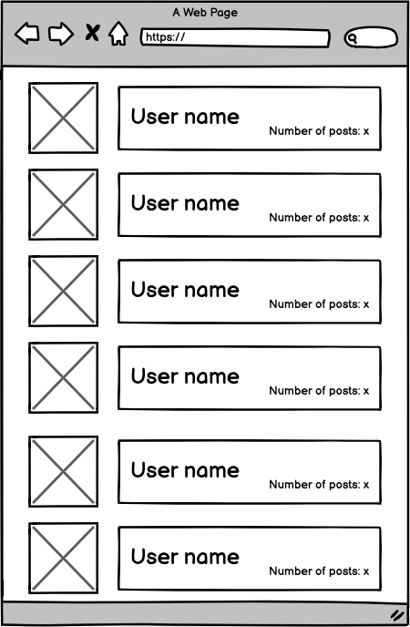
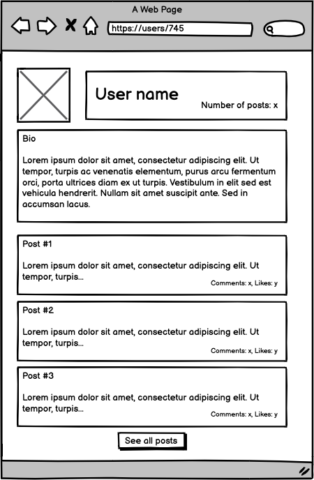

<a name="readme-top"></a>

# 📗 Table of Contents

- [📗 Table of Contents](#-table-of-contents)
- [📖 Metrics ](#-metrics-)
  - [🛠 Built With ](#-built-with-)
    - [Tech Stack ](#tech-stack-)
    - [Key Features ](#key-features-)
  - [🚀 Live Demo ](#-live-demo-)
  - [💻 Getting Started ](#-getting-started-)
    - [Prerequisites](#prerequisites)
    - [Setup](#setup)
    - [Install](#install)
    - [Usage](#usage)
    - [Run tests](#run-tests)
    - [Deployment](#deployment)
  - [👥 Authors ](#-authors-)
  - [🔭 Future Features ](#-future-features-)
  - [🤝 Contributing ](#-contributing-)
  - [⭐️ Show your support ](#️-show-your-support-)
  - [🙏 Acknowledgments ](#-acknowledgments-)
  - [❓ FAQ ](#-faq-)
  - [📝 License ](#-license-)

# 📖 Blog website <a name="about-project"></a>

**Blog website** built in Ruby on Rails. Fully functional website that will show the list of posts and empower readers to interact with them by adding comments and liking posts.

## Entity Relationship Diagram


## Blog UI guidelines







## 🛠 Built With <a name="built-with"></a>

### Tech Stack <a name="tech-stack"></a>

<details>
  <summary>Client</summary>
  <ul>
    <li><a href="https://guides.rubyonrails.org/index.html">Ruby on Rails</a></li>
  </ul>
</details>

<details>
  <summary>Database</summary>
  <ul>
    <li><a href="https://www.postgresql.org/docs/">PostgreSQL</a></li>
  </ul>
</details>

### Key Features <a name="key-features"></a>

- **List of blog posts preserved in PostgreSQL**
- **Posts Interaction (comments and likes)**
- **Blog redaction**

<p align="right">(<a href="#readme-top">back to top</a>)</p>

## 💻 Getting Started <a name="getting-started"></a>

To get a local copy up and running, follow these steps.

### Prerequisites

In order to run this project you need:

- Git SCM
- Ruby installed
- Rails installed

### Setup

Clone this repository to your desired folder:

```
git clone https://github.com/jorgeabrahan/blog.git
```

Or download the ZIP folder.

### Install

Once you've cloned the repository simply run:

```
bundle install
rails db:create
rails db:migrate
```

### Usage

To run the project, if you are on the blog folder path on your terminal you can execute the following command:

```
rails server
```

### Run tests

To start tests run:

```
rspec spec
```

### Deployment

- Render
- Heroku

<p align="right">(<a href="#readme-top">back to top</a>)</p>

## 👥 Authors <a name="authors"></a>

👤 **Jorge Abrahan**

- GitHub: [@jorgeabrahan](https://github.com/jorgeabrahan)
- LinkedIn: [Jorge Abrahan](https://www.linkedin.com/in/jorge-siguenza/?locale=en_US)

<p align="right">(<a href="#readme-top">back to top</a>)</p>

## 🔭 Future Features <a name="future-features"></a>

- [ ] **Create tests**
- [ ] **Create interface**

<p align="right">(<a href="#readme-top">back to top</a>)</p>

## 🤝 Contributing <a name="contributing"></a>

Contributions, issues, and feature requests are welcome!

Feel free to check the [issues page](../../issues/).

<p align="right">(<a href="#readme-top">back to top</a>)</p>

<!-- SUPPORT -->

## ⭐️ Show your support <a name="support"></a>

If you like this project you can just cheer me up with a comment 🙂!

<p align="right">(<a href="#readme-top">back to top</a>)</p>

## 🙏 Acknowledgments <a name="acknowledgements"></a>

The whole project idea comes from Microverse

<p align="right">(<a href="#readme-top">back to top</a>)</p>

## ❓ FAQ <a name="faq"></a>

- **What is this project main purpose?**

  - To practice working with Ruby on Rails, PostgreSQL and interpret entity relationship diagrams, UML class diagrams and build UIs in ruby based on design guidelines.

<p align="right">(<a href="#readme-top">back to top</a>)</p>

## 📝 License <a name="license"></a>

This project is [MIT](./LICENSE) licensed.

<p align="right">(<a href="#readme-top">back to top</a>)</p>
